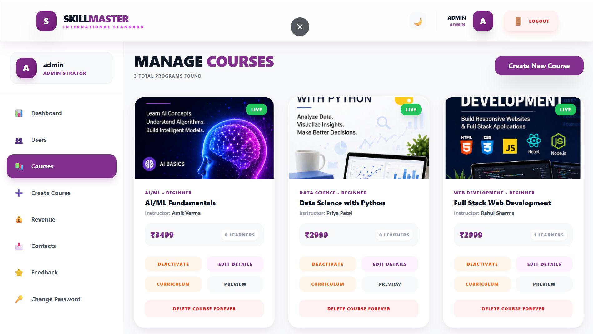

# SkillMaster - Premium E-Learning Management System

SkillMaster is a full-stack Learning Management System (LMS) built to provide a modern, role-based online learning experience for students, faculty, and administrators.

The platform includes course management, lectures, assignments, progress tracking, certificates, payments, feedback, live sessions, responsive dashboards, cloud-based media storage, and role-based access control.

## 🚀 Live Demo

👉 [**Open SkillMaster Live**](https://skillmaster-frontend.onrender.com)

> You can explore the deployed SkillMaster application directly from the live environment.

---

## ✨ Project Overview

SkillMaster is designed around three major user roles:

- **Student** – Browse courses, enroll, learn through video lectures, submit assignments, track progress, earn certificates, and manage profile.
- **Faculty** – Create and manage courses, upload lectures and study materials, manage assignments, track students, answer queries, and manage live sessions.
- **Admin** – Manage users, courses, platform analytics, revenue, feedback, and administrative settings.

---

## 🔷 Key Features

### 👨‍💼 Admin Features

- **Intelligence Dashboard** with platform statistics and revenue analytics
- **Course Management** with complete CRUD operations
- Publish / Unpublish courses
- **User Management** for students and faculty
- Block / Unblock users
- Revenue and order monitoring
- CSV platform report download
- Feedback management
- Administrative settings
- Responsive admin navigation and mobile menu

### 👨‍🎓 Student Features

- Modern course browser
- Course details and enrollment
- Razorpay-based course checkout
- Video lecture learning
- PDF study materials
- Learning progress tracking
- Course completion certificates
- Assignment viewing and submission
- Faculty Q&A support
- Live sessions
- Payment history
- Profile and password management
- Responsive student dashboard
- Cloudinary profile avatar support

### 👨‍🏫 Faculty Features

- Faculty dashboard
- Create, edit, publish and manage courses
- Upload course thumbnails
- Upload lecture videos and study materials
- Course curriculum management
- Assignment creation and editing
- Student progress tracking
- Student profile viewing
- Student query management
- Live session management
- Faculty profile and settings
- Responsive faculty navigation and mobile menu

---

## 🧩 Technology Stack

### Frontend

- React.js
- Vite
- Tailwind CSS
- Redux Toolkit
- React Router
- Recharts
- React Player
- React Hot Toast

### Backend

- Node.js
- Express.js
- MongoDB
- Mongoose
- JWT Authentication
- Bcrypt
- Helmet
- Multer

### Cloud & Services

- **Cloudinary** – Image and file storage
- **Razorpay** – Course payments
- **Resend** – Password-reset email service
- **Render** – Production deployment

---

## 🏗️ Project Architecture

```text
SkillMaster
│
├── frontend
│   ├── src
│   │   ├── components
│   │   ├── layouts
│   │   ├── pages
│   │   ├── redux
│   │   ├── services
│   │   └── utils
│   │
│   └── ...
│
├── backend
│   ├── config
│   ├── controllers
│   ├── middleware
│   ├── models
│   ├── routes
│   ├── utils
│   └── server.js
│
└── docs
```

---

# 📸 Project Screenshots

## 🏠 Home Page


---

## 🔐 Login Page


---

## 👨‍🎓 Student Dashboard


---

## 👨‍🏫 Faculty Dashboard


---

## 👨‍💼 Admin Dashboard


---

## 📚 Course Details Page



---

# 📄 Documentation

The project includes detailed documentation covering installation, API usage, project architecture, and deployment.

- [Setup & Installation Guide](./docs/SETUP_GUIDE.md)
- [API Documentation](./docs/API_DOCUMENTATION.md)
- [Architecture & Folder Structure](./docs/ARCHITECTURE.md)
- [Deployment Guide](./docs/DEPLOYMENT.md)

---

# 🎯 Resume Highlights

- Developed a full-stack MERN Learning Management System (LMS).
- Implemented JWT authentication and role-based access control.
- Built dedicated Student, Faculty, and Admin dashboards.
- Implemented complete course CRUD operations.
- Integrated Razorpay for online course payments.
- Integrated Cloudinary for production media storage.
- Developed RESTful APIs using Node.js and Express.js.
- Implemented assignment tracking and student submissions.
- Added learning progress tracking and course completion certificates.
- Built faculty, student, and admin workflows with protected routes.
- Designed responsive layouts for desktop and mobile devices.
- Used MongoDB with Mongoose for application data management.
- Implemented profile avatar and course thumbnail management.
- Added responsive navigation for Admin, Faculty, and Student portals.
- Deployed the production frontend and backend using Render.

---

# 🚀 Future Enhancements

- AI-Powered Course Recommendations
- Mobile Application (Android/iOS)
- Real-Time Chat & Video Sessions
- Attendance Analytics Dashboard
- Multi-Language Support
- Advanced Learning Analytics
- Push Notifications
- Personalized Learning Paths

---

# 👨‍💻 Author

**Smitkumar Lad**

MCA Student | MERN Stack Developer

GitHub:
https://github.com/Smitlad-11

---

# 📦 Project Repository

👉 **[View SkillMaster Source Code on GitHub](https://github.com/Smitlad-11/SkillMaster)**

---

# 🌐 Live Project

👉 **[SkillMaster Live Application](https://skillmaster-frontend.onrender.com)**

---

## 📌 Project Information

| Item | Details |
|---|---|
| Project Name | SkillMaster |
| Project Type | Learning Management System |
| Architecture | MERN Stack |
| Frontend | React.js + Vite |
| Backend | Node.js + Express.js |
| Database | MongoDB |
| Authentication | JWT |
| Cloud Storage | Cloudinary |
| Payment Gateway | Razorpay |
| Email Service | Resend |
| Deployment | Render |

---

## ⭐ Project Highlights

SkillMaster demonstrates a complete full-stack workflow from authentication and role-based authorization to course management, media uploads, learning progress, assignments, payments, certificates, feedback, and production deployment.

The project provides separate experiences for students, faculty members, and administrators and includes responsive interfaces for desktop and mobile devices.

---

## 🔗 Quick Access

- 🌐 [**Live Application**](https://skillmaster-frontend.onrender.com)
- 💻 [**GitHub Repository**](https://github.com/Smitlad-11/SkillMaster)
- 📚 [**Setup Guide**](./docs/SETUP_GUIDE.md)
- 🔌 [**API Documentation**](./docs/API_DOCUMENTATION.md)
- 🏗️ [**Architecture Documentation**](./docs/ARCHITECTURE.md)
- 🚀 [**Deployment Guide**](./docs/DEPLOYMENT.md)