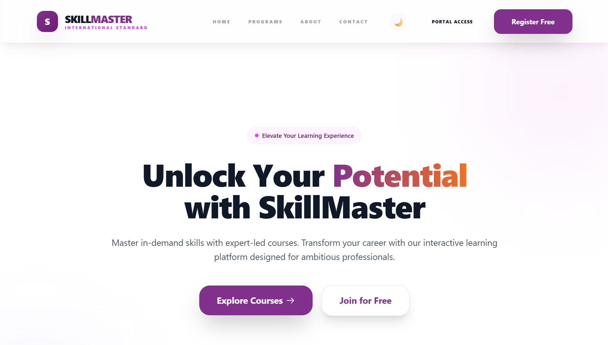
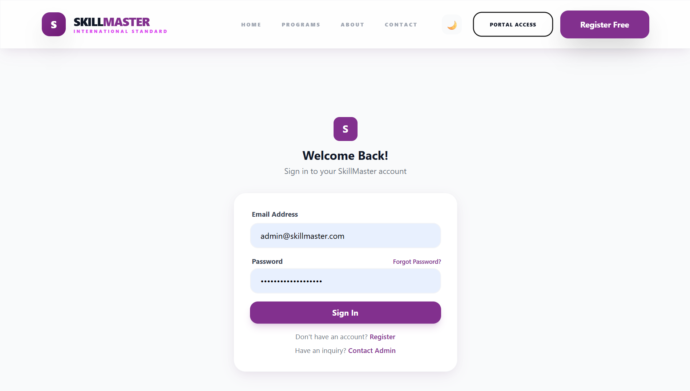
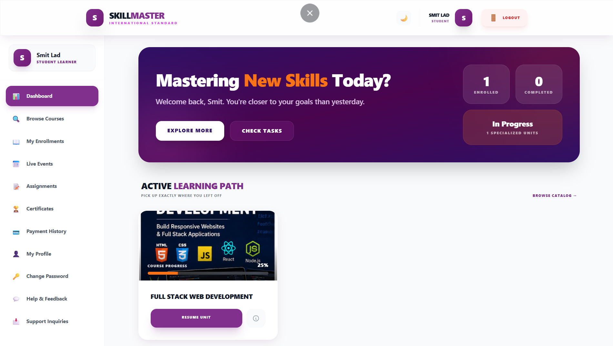
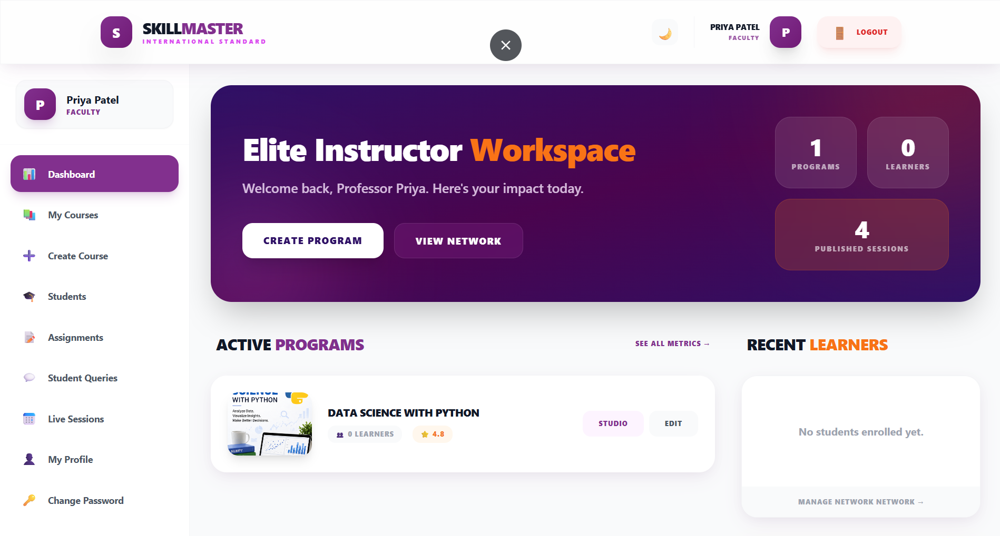
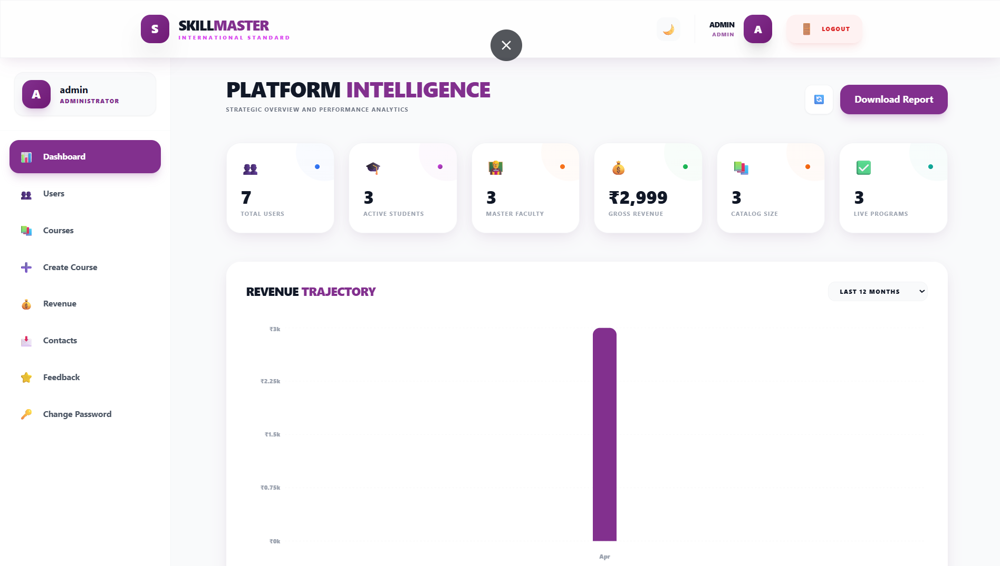

# SkillMaster - Premium E-Learning Management System

SkillMaster is a world-class, high-fidelity Learning Management System (LMS) designed for a premium educational experience. Inspired by industry leaders like BYJU'S, it features a sophisticated design language, robust role-based access control, and a full-stack MERN architecture.

## 🚀 Quick Links
- [Setup & Installation Guide](./docs/SETUP_GUIDE.md)
- [API Documentation](./docs/API_DOCUMENTATION.md)
- [Architecture & Folder Structure](./docs/ARCHITECTURE.md)
- [Deployment Guide](./docs/DEPLOYMENT.md)

## 🔷 Key Features

### 1️⃣ Administrative Control
- **Intelligence Dashboard**: Real-time analytics with interactive charts.
- **Course Lifecycle**: Full CRUD operations for courses and curricula.
- **User Oversight**: Granular management of students and faculty, including blocking/unblocking.
- **Financial Reporting**: Instant CSV exports of platform performance and revenue.

### 2️⃣ Student Learning Experience
- **Interactive Portal**: High-end course browser and detailed detail pages.
- **Premium Checkout**: Secure Razorpay integration for seamless enrollments.
- **Learning Path**: Progress tracking with live bars and course completion certificates.
- **Engagement**: Integrated Q&A system and support for live masterclasses.

### 3️⃣ Faculty Empowerment
- **Content Hub**: Streamlined lecture uploading (Video + PDF).
- **Academic Management**: Assignment creation and direct student progress tracking.
- **Interaction**: Resolve student queries and schedule live interactive sessions.

## 🔷 Technology Stack
- **Frontend**: React.js (Vite), Tailwind CSS, Redux Toolkit, Framer Motion.
- **Backend**: Node.js, Express.js, MongoDB (Mongoose), JWT Authentication.
- **Payments**: Razorpay Gateway.
- **Infrastructure**: Multer (File uploads), Bcrypt (Security), Helmet (Headers).

---

# 📸 Project Screenshots

## 🏠 Home Page

---

## 🔐 Login Page

---

## 👨‍🎓 Student Dashboard

---

## 👨‍🏫 Faculty Dashboard

---

## 👨‍💼 Admin Dashboard

---

## 📚 Course Details Page

---

# 🎯 Resume Highlights

- Developed a Full-Stack MERN Learning Management System (LMS).
- Implemented JWT Authentication and Role-Based Access Control.
- Integrated Razorpay Payment Gateway for secure course enrollments.
- Built dedicated Student, Faculty, and Admin dashboards.
- Developed RESTful APIs using Node.js and Express.js.
- Utilized MongoDB for scalable data storage and management.
- Implemented assignment tracking, certificates, feedback, and live sessions.
- Designed responsive UI using React.js, Vite, Tailwind CSS, and Redux Toolkit.

---

# 🚀 Future Enhancements

- AI-Powered Course Recommendations
- Mobile Application (Android/iOS)
- Real-Time Chat & Video Sessions
- Attendance Analytics Dashboard
- Multi-Language Support
- Advanced Learning Analytics

---

## 👨‍💻 Author

**Smitkumar Lad**

MCA Student | MERN Stack Developer

GitHub: https://github.com/Smitlad-11

Project Repository:
https://github.com/Smitlad-11/SkillMaster